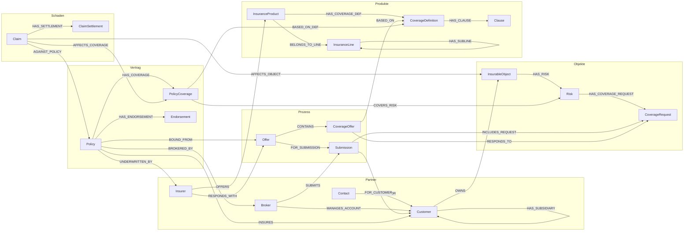

# Ontologie: UWWB (Underwriting Workbench)

Stand: 2026-04-09 | Version: 1.0 | Status: Erstdurchlauf abgeschlossen

---

## 1. Domäne

### Beschreibung
Underwriting Workbench (UWWB) für Industrieversicherer, Industrieversicherungsmakler oder Assekuradeure. Die Software bildet alle versicherungsfachlichen Prozesse ab: Verwaltung von Kunden-, Angebots-, Vertrags-, Schaden- und Abrechnungsdaten sowie Risikodaten der Kunden (Unternehmensstruktur, Gebäude, Maschinen, Mitarbeiter, Projekte, Finanzkennzahlen). Primäre Nutzer sind Underwriter, die sowohl operative Arbeitsvorgänge bearbeiten als auch Risikodaten analysieren und beurteilen.

### Zwei Ebenen der Versicherungswirtschaft

**Ebene A — Unternehmen und Risiken (Nachfrageseite):**
- Unternehmen (Versicherungsnehmer) mit Konzernstruktur (Tochterunternehmen)
- Versicherbare Objekte: Maschinen, Fahrzeuge, Gebäude, Mitarbeiter, Veranstaltungen, Projekte, Dienstleistungen
- Risiken je Objekt: Diebstahl, Feuer, Beschädigung, Entwertung, Produktionsausfall etc.
- Deckungswünsche je Risiko: gewünschte Versicherungssumme, Klauseln, Zeitraum

**Ebene B — Versicherer und Versicherungsprodukte (Angebotsseite):**
- Versicherer bieten Versicherungsprodukte in Sparten an
- Produkte bündeln Deckungsdefinitionen inkl. Klauseln und Prämienberechnung
- Deckungsdefinitionen: max. Versicherungssumme, Selbstbeteiligung, Ausschlüsse, Bedingungswerk

### Geschäftsprozesse
- Ausschreibungsprozess: Makler nimmt Risikodaten auf → Ausschreibung an Versicherer → Angebote mit Deckungsangeboten → Verhandlung → Vertragsbindung (Police)
- Laufende Vertragsanpassungen: Nachträge (Endorsements) bei Änderungen an Objekten, Struktur oder Schadenverlauf
- Schadenmanagement: Schadenerfassung → Zuordnung zu Objekten/Deckungen → Regulierungsschritte (Teilregulierungen, Teilzahlungen, Nachreservierungen)

### Analytics Use Cases
| # | Frage | Beschreibung | Status |
|---|-------|-------------|--------|
| 1 | Objektbestand eines Unternehmens | Welche Objekte hat ein Unternehmen? Welche Risiken haben diese Objekte? | Modelliert |
| 2 | Deckungszuordnung | Welche Deckungen/Verträge sind den Risiken/Objekten zugeordnet? | Modelliert |
| 3 | Beteiligte Versicherer | Wie viele Produkte/Versicherer sind an der Risikodeckung beteiligt? | Modelliert |
| 4 | Risikokonzentration | Regional, nach Branche, nach max. Schadenshöhe über mehrere Verträge | Modelliert |
| 5 | Makler-Performance | Wer bringt am meisten Geschäft? | Modelliert |
| 6 | Deckungslücken | Wo ist ein Unternehmen unterversichert? | Modelliert |
| 7 | Mehrfachdeckungen | Wo bestehen Überschneidungen über mehrere Verträge? | Modelliert |
| 8 | Schadenquoten | Auf Ebene Deckung, Objekt, Unternehmen, Sparte, Versicherer | Modelliert |

---

## 2. Node Labels

### Partner-Modell

Geschäftspartner (Unternehmen, Versicherer, Makler, Ansprechpartner) werden einheitlich als **Partner** modelliert. Die Rolle wird über **Multi-Labels** abgebildet: `:Partner:Customer`, `:Partner:Insurer`, `:Partner:Broker`, `:Partner:Contact`. Ein Partner kann mehrere Rollen gleichzeitig haben.

### Übersicht

**Partner & Rollen (1 Basis-Label + 4 Rollen-Labels):**
| Label | Beschreibung | Kern-Properties |
|-------|-------------|----------------|
| Partner | Basis-Label für alle Geschäftspartner | legalName, partnerType, country |
| Customer | Rollen-Label: Versicherungsnehmer / Kunde | industry, revenue |
| Insurer | Rollen-Label: Versicherungsgesellschaft | rating |
| Broker | Rollen-Label: Versicherungsmakler | licenseNumber |
| Contact | Rollen-Label: Ansprechpartner / natürliche Person | firstName, lastName, email, phone |

**Versicherbare Objekte (1 Basis-Label + 5 Typ-Labels):**
| Label | Beschreibung | Kern-Properties |
|-------|-------------|----------------|
| InsurableObject | Basis-Label für versicherbare Objekte | objectName, location, insuredValue |
| Building | Typ-Label: Gebäude | constructionYear, area, fireProtectionClass |
| Machine | Typ-Label: Maschine / Anlage | manufacturer, acquisitionValue, commissioningDate |
| Vehicle | Typ-Label: Fahrzeug | licensePlate, vehicleType, acquisitionValue |
| Person | Typ-Label: Versicherbare Schlüsselperson | firstName, lastName, role |
| Project | Typ-Label: Projekt / Vorhaben | projectName, startDate, endDate |

**Risiko & Deckungswunsch:**
| Label | Beschreibung | Kern-Properties |
|-------|-------------|----------------|
| Risk | Einem Objekt zugeordnetes Risiko | riskType, maxExposure, probability |
| CoverageRequest | Deckungswunsch pro Risiko | requestedSum, deductible, periodStart, periodEnd |

**Versicherungsprodukte:**
| Label | Beschreibung | Kern-Properties |
|-------|-------------|----------------|
| InsuranceProduct | Produkt eines Versicherers | productName, validFrom, validTo |
| InsuranceLine | Sparte (Hierarchie über Selbstreferenz) | lineName, lineCode |
| CoverageDefinition | Deckungsdefinition innerhalb eines Produkts | maxSum, deductible, exclusions |
| Clause | Klausel / Bedingung | clauseCode, title, text |

**Geschäftsprozesse:**
| Label | Beschreibung | Kern-Properties |
|-------|-------------|----------------|
| Submission | Ausschreibung | submissionDate, deadline, status |
| Offer | Angebot auf Ausschreibung | premiumAmount, validUntil, status |
| CoverageOffer | Deckungsangebot innerhalb eines Angebots | offeredSum, offeredDeductible, premiumShare |
| Policy | Versicherungsvertrag / Police | policyNumber, effectiveDate, expirationDate, totalPremium |
| PolicyCoverage | Finale Deckung im Vertrag | coveredSum, deductible, premiumShare |
| Endorsement | Nachtrag / Vertragsanpassung | endorsementNumber, effectiveDate, changeDescription |

**Schadenmanagement:**
| Label | Beschreibung | Kern-Properties |
|-------|-------------|----------------|
| Claim | Schadenfall | claimDate, claimAmount, status |
| ClaimSettlement | Regulierungsschritt | settlementDate, amount, settlementType |

**Flexible Attribute:**
| Label | Beschreibung | Kern-Properties |
|-------|-------------|----------------|
| AttributeTemplate | Vorlage für Zusatzattribute | templateName, dataType, unit |
| CustomAttribute | Konkreter Attributwert | value |

### Detail-Properties pro Label

Standardmässig erhalten alle Nodes: `id` (String, Unique), `createdAt` (DateTime), `updatedAt` (DateTime). Zusätzlich `status` wo sinnvoll.

**Konvention `name`-Property:** Jeder Node-Typ MUSS eine sprechende Anzeige-Property besitzen, die im Graph-Explorer als Label sichtbar ist. Bei den meisten Typen ist das `name` (String). Ausnahmen: Partner-Typen verwenden `legalName`, InsurableObjects verwenden `objectName`, InsuranceProduct `productName`, InsuranceLine `lineName`, AttributeTemplate `templateName`, Clause `title`. Der `name`-Wert soll kurz und fachlich verständlich sein (z.B. "Feuer Produktionshalle", "Vollkasko LKW 500k").

#### Partner (Basis-Label)
| Property | Neo4j-Typ | Pflicht | Index | Beschreibung |
|----------|-----------|---------|-------|-------------|
| id | String | Ja | Unique | Eindeutige ID |
| legalName | String | Ja | Range | Offizieller Name (Firma oder vollständiger Name) |
| partnerType | String | Ja | Range | organization / person |
| country | String | Nein | Range | Sitzland |
| status | String | Ja | Range | active / inactive |
| createdAt | DateTime | Ja | Nein | Erstellungszeitpunkt |
| updatedAt | DateTime | Ja | Nein | Letzter Änderungszeitpunkt |

#### Customer (Rollen-Label, Multi-Label mit Partner)
| Property | Neo4j-Typ | Pflicht | Index | Beschreibung |
|----------|-----------|---------|-------|-------------|
| industry | String | Nein | Range | Branche (z.B. Automotive, Pharma) |
| revenue | Float | Nein | Nein | Jahresumsatz in EUR |

#### Insurer (Rollen-Label, Multi-Label mit Partner)
| Property | Neo4j-Typ | Pflicht | Index | Beschreibung |
|----------|-----------|---------|-------|-------------|
| rating | String | Nein | Range | Finanzstärke-Rating (z.B. A+, AA-) |

#### Broker (Rollen-Label, Multi-Label mit Partner)
| Property | Neo4j-Typ | Pflicht | Index | Beschreibung |
|----------|-----------|---------|-------|-------------|
| licenseNumber | String | Nein | Range | Zulassungsnummer |

#### Contact (Rollen-Label, Multi-Label mit Partner)
| Property | Neo4j-Typ | Pflicht | Index | Beschreibung |
|----------|-----------|---------|-------|-------------|
| firstName | String | Ja | Nein | Vorname |
| lastName | String | Ja | Range | Nachname |
| email | String | Nein | Range | E-Mail-Adresse |
| phone | String | Nein | Nein | Telefonnummer |

#### InsurableObject (Basis-Label)
| Property | Neo4j-Typ | Pflicht | Index | Beschreibung |
|----------|-----------|---------|-------|-------------|
| id | String | Ja | Unique | Eindeutige ID |
| objectName | String | Ja | Range | Bezeichnung des Objekts |
| location | String | Nein | Range | Standort / Adresse |
| insuredValue | Float | Nein | Nein | Versicherungswert in EUR |
| status | String | Ja | Range | active / decommissioned |
| createdAt | DateTime | Ja | Nein | Erstellungszeitpunkt |
| updatedAt | DateTime | Ja | Nein | Letzter Änderungszeitpunkt |

#### Building (Multi-Label mit InsurableObject)
| Property | Neo4j-Typ | Pflicht | Index | Beschreibung |
|----------|-----------|---------|-------|-------------|
| constructionYear | Integer | Nein | Nein | Baujahr |
| area | Float | Nein | Nein | Fläche in m² |
| fireProtectionClass | String | Nein | Range | Brandschutzklasse |
| floors | Integer | Nein | Nein | Anzahl Stockwerke |

#### Machine (Multi-Label mit InsurableObject)
| Property | Neo4j-Typ | Pflicht | Index | Beschreibung |
|----------|-----------|---------|-------|-------------|
| manufacturer | String | Nein | Range | Hersteller |
| acquisitionValue | Float | Nein | Nein | Anschaffungswert in EUR |
| commissioningDate | Date | Nein | Nein | Inbetriebnahmedatum |
| machineType | String | Nein | Range | Maschinentyp |

#### Vehicle (Multi-Label mit InsurableObject)
| Property | Neo4j-Typ | Pflicht | Index | Beschreibung |
|----------|-----------|---------|-------|-------------|
| licensePlate | String | Nein | Range | Kennzeichen |
| vehicleType | String | Nein | Range | PKW, LKW, Spezialfahrzeug etc. |
| acquisitionValue | Float | Nein | Nein | Anschaffungswert in EUR |

#### Person (Multi-Label mit InsurableObject)
| Property | Neo4j-Typ | Pflicht | Index | Beschreibung |
|----------|-----------|---------|-------|-------------|
| firstName | String | Ja | Nein | Vorname |
| lastName | String | Ja | Range | Nachname |
| role | String | Nein | Range | Funktion im Unternehmen |

#### Project (Multi-Label mit InsurableObject)
| Property | Neo4j-Typ | Pflicht | Index | Beschreibung |
|----------|-----------|---------|-------|-------------|
| projectName | String | Ja | Range | Projektbezeichnung |
| startDate | Date | Nein | Nein | Projektstart |
| endDate | Date | Nein | Nein | Projektende |

#### Risk
| Property | Neo4j-Typ | Pflicht | Index | Beschreibung |
|----------|-----------|---------|-------|-------------|
| id | String | Ja | Unique | Eindeutige ID |
| riskType | String | Ja | Range | Feuer, Diebstahl, Produktionsausfall etc. |
| maxExposure | Float | Nein | Nein | Maximales Schadenspotenzial in EUR |
| probability | String | Nein | Nein | Eintrittswahrscheinlichkeit (low/medium/high) |
| description | String | Nein | Nein | Risikobeschreibung |
| createdAt | DateTime | Ja | Nein | Erstellungszeitpunkt |
| updatedAt | DateTime | Ja | Nein | Letzter Änderungszeitpunkt |

#### CoverageRequest
| Property | Neo4j-Typ | Pflicht | Index | Beschreibung |
|----------|-----------|---------|-------|-------------|
| id | String | Ja | Unique | Eindeutige ID |
| requestedSum | Float | Ja | Nein | Gewünschte Versicherungssumme in EUR |
| deductible | Float | Nein | Nein | Gewünschte Selbstbeteiligung in EUR |
| periodStart | Date | Ja | Nein | Gewünschter Deckungsbeginn |
| periodEnd | Date | Ja | Nein | Gewünschtes Deckungsende |
| status | String | Ja | Range | open / matched / expired |
| createdAt | DateTime | Ja | Nein | Erstellungszeitpunkt |
| updatedAt | DateTime | Ja | Nein | Letzter Änderungszeitpunkt |

#### InsuranceProduct
| Property | Neo4j-Typ | Pflicht | Index | Beschreibung |
|----------|-----------|---------|-------|-------------|
| id | String | Ja | Unique | Eindeutige ID |
| productName | String | Ja | Range | Produktbezeichnung |
| validFrom | Date | Nein | Nein | Gültig ab |
| validTo | Date | Nein | Nein | Gültig bis |
| status | String | Ja | Range | active / discontinued |
| createdAt | DateTime | Ja | Nein | Erstellungszeitpunkt |
| updatedAt | DateTime | Ja | Nein | Letzter Änderungszeitpunkt |

#### InsuranceLine
| Property | Neo4j-Typ | Pflicht | Index | Beschreibung |
|----------|-----------|---------|-------|-------------|
| id | String | Ja | Unique | Eindeutige ID |
| lineName | String | Ja | Range | Spartenname (Haftpflicht, Property, Cyber etc.) |
| lineCode | String | Ja | Range | Spartenkürzel |
| createdAt | DateTime | Ja | Nein | Erstellungszeitpunkt |
| updatedAt | DateTime | Ja | Nein | Letzter Änderungszeitpunkt |

#### CoverageDefinition
| Property | Neo4j-Typ | Pflicht | Index | Beschreibung |
|----------|-----------|---------|-------|-------------|
| id | String | Ja | Unique | Eindeutige ID |
| name | String | Ja | Range | Deckungsbezeichnung |
| maxSum | Float | Nein | Nein | Maximale Versicherungssumme in EUR |
| deductible | Float | Nein | Nein | Standard-Selbstbeteiligung in EUR |
| exclusions | String | Nein | Nein | Ausschlussbeschreibung |
| createdAt | DateTime | Ja | Nein | Erstellungszeitpunkt |
| updatedAt | DateTime | Ja | Nein | Letzter Änderungszeitpunkt |

#### Clause
| Property | Neo4j-Typ | Pflicht | Index | Beschreibung |
|----------|-----------|---------|-------|-------------|
| id | String | Ja | Unique | Eindeutige ID |
| clauseCode | String | Ja | Range | Klauselkürzel |
| title | String | Ja | Range | Klauseltitel |
| text | String | Nein | Nein | Volltext der Klausel |
| createdAt | DateTime | Ja | Nein | Erstellungszeitpunkt |
| updatedAt | DateTime | Ja | Nein | Letzter Änderungszeitpunkt |

#### Submission
| Property | Neo4j-Typ | Pflicht | Index | Beschreibung |
|----------|-----------|---------|-------|-------------|
| id | String | Ja | Unique | Eindeutige ID |
| submissionDate | Date | Ja | Range | Ausschreibungsdatum |
| deadline | Date | Nein | Range | Angebotsfrist |
| status | String | Ja | Range | draft / open / closed / bound |
| description | String | Nein | Nein | Beschreibung der Ausschreibung |
| createdAt | DateTime | Ja | Nein | Erstellungszeitpunkt |
| updatedAt | DateTime | Ja | Nein | Letzter Änderungszeitpunkt |

#### Offer
| Property | Neo4j-Typ | Pflicht | Index | Beschreibung |
|----------|-----------|---------|-------|-------------|
| id | String | Ja | Unique | Eindeutige ID |
| premiumAmount | Float | Ja | Nein | Gesamtprämie in EUR |
| validUntil | Date | Nein | Nein | Angebot gültig bis |
| status | String | Ja | Range | pending / accepted / rejected / expired |
| createdAt | DateTime | Ja | Nein | Erstellungszeitpunkt |
| updatedAt | DateTime | Ja | Nein | Letzter Änderungszeitpunkt |

#### CoverageOffer
| Property | Neo4j-Typ | Pflicht | Index | Beschreibung |
|----------|-----------|---------|-------|-------------|
| id | String | Ja | Unique | Eindeutige ID |
| offeredSum | Float | Ja | Nein | Angebotene Versicherungssumme in EUR |
| offeredDeductible | Float | Nein | Nein | Angebotene Selbstbeteiligung in EUR |
| premiumShare | Float | Nein | Nein | Prämienanteil für diese Deckung in EUR |
| createdAt | DateTime | Ja | Nein | Erstellungszeitpunkt |
| updatedAt | DateTime | Ja | Nein | Letzter Änderungszeitpunkt |

#### Policy
| Property | Neo4j-Typ | Pflicht | Index | Beschreibung |
|----------|-----------|---------|-------|-------------|
| id | String | Ja | Unique | Eindeutige ID |
| policyNumber | String | Ja | Unique | Policennummer |
| effectiveDate | Date | Ja | Range | Vertragsbeginn |
| expirationDate | Date | Ja | Range | Vertragsende |
| totalPremium | Float | Ja | Nein | Gesamtprämie in EUR |
| status | String | Ja | Range | active / expired / cancelled |
| createdAt | DateTime | Ja | Nein | Erstellungszeitpunkt |
| updatedAt | DateTime | Ja | Nein | Letzter Änderungszeitpunkt |

#### PolicyCoverage
| Property | Neo4j-Typ | Pflicht | Index | Beschreibung |
|----------|-----------|---------|-------|-------------|
| id | String | Ja | Unique | Eindeutige ID |
| coveredSum | Float | Ja | Nein | Gedeckte Versicherungssumme in EUR |
| deductible | Float | Nein | Nein | Selbstbeteiligung in EUR |
| premiumShare | Float | Nein | Nein | Prämienanteil in EUR |
| createdAt | DateTime | Ja | Nein | Erstellungszeitpunkt |
| updatedAt | DateTime | Ja | Nein | Letzter Änderungszeitpunkt |

#### Endorsement
| Property | Neo4j-Typ | Pflicht | Index | Beschreibung |
|----------|-----------|---------|-------|-------------|
| id | String | Ja | Unique | Eindeutige ID |
| endorsementNumber | String | Ja | Range | Nachtragsnummer |
| effectiveDate | Date | Ja | Range | Gültig ab |
| changeDescription | String | Ja | Nein | Beschreibung der Änderung |
| premiumAdjustment | Float | Nein | Nein | Prämienanpassung in EUR |
| createdAt | DateTime | Ja | Nein | Erstellungszeitpunkt |
| updatedAt | DateTime | Ja | Nein | Letzter Änderungszeitpunkt |

#### Claim
| Property | Neo4j-Typ | Pflicht | Index | Beschreibung |
|----------|-----------|---------|-------|-------------|
| id | String | Ja | Unique | Eindeutige ID |
| claimNumber | String | Ja | Unique | Schadennummer |
| claimDate | Date | Ja | Range | Schadendatum |
| claimAmount | Float | Nein | Nein | Geschätzter Schadenbetrag in EUR |
| reserveAmount | Float | Nein | Nein | Reservierter Betrag in EUR |
| status | String | Ja | Range | reported / open / settled / closed |
| description | String | Nein | Nein | Schadenbeschreibung |
| createdAt | DateTime | Ja | Nein | Erstellungszeitpunkt |
| updatedAt | DateTime | Ja | Nein | Letzter Änderungszeitpunkt |

#### ClaimSettlement
| Property | Neo4j-Typ | Pflicht | Index | Beschreibung |
|----------|-----------|---------|-------|-------------|
| id | String | Ja | Unique | Eindeutige ID |
| settlementDate | Date | Ja | Range | Regulierungsdatum |
| amount | Float | Ja | Nein | Regulierungsbetrag in EUR |
| settlementType | String | Ja | Range | partial / final / reserve_adjustment |
| description | String | Nein | Nein | Beschreibung |
| createdAt | DateTime | Ja | Nein | Erstellungszeitpunkt |
| updatedAt | DateTime | Ja | Nein | Letzter Änderungszeitpunkt |

#### AttributeTemplate
| Property | Neo4j-Typ | Pflicht | Index | Beschreibung |
|----------|-----------|---------|-------|-------------|
| id | String | Ja | Unique | Eindeutige ID |
| templateName | String | Ja | Range | Attributname (z.B. "Tragfähigkeit") |
| dataType | String | Ja | Nein | String / Float / Integer / Boolean / Date |
| unit | String | Nein | Nein | Einheit (z.B. kg, m², kW) |
| createdAt | DateTime | Ja | Nein | Erstellungszeitpunkt |
| updatedAt | DateTime | Ja | Nein | Letzter Änderungszeitpunkt |

#### CustomAttribute
| Property | Neo4j-Typ | Pflicht | Index | Beschreibung |
|----------|-----------|---------|-------|-------------|
| id | String | Ja | Unique | Eindeutige ID |
| value | String | Ja | Nein | Attributwert (als String gespeichert, Typ via Template) |
| createdAt | DateTime | Ja | Nein | Erstellungszeitpunkt |
| updatedAt | DateTime | Ja | Nein | Letzter Änderungszeitpunkt |

---

## 3. Relationship Types

### Übersicht

| # | Type | Von | Nach | Kardinalität | Properties | Beschreibung |
|---|------|-----|------|--------------|------------|-------------|
| **Partner & Struktur** | | | | | | |
| 1 | HAS_SUBSIDIARY | Customer | Customer | 1:n | — | Konzernstruktur (Mutter→Tochter) |
| 2 | WORKS_FOR | Contact | Partner | n:1 | role, since | Ansprechpartner gehört zu Partner |
| 3 | MANAGES_ACCOUNT | Broker | Customer | n:m | since | Makler betreut Kunden |
| **Objekte & Risiken** | | | | | | |
| 4 | OWNS | Customer | InsurableObject | 1:n | since | Kunde besitzt versicherbares Objekt |
| 5 | HAS_RISK | InsurableObject | Risk | 1:n | — | Objekt hat Risiko |
| 6 | HAS_COVERAGE_REQUEST | Risk | CoverageRequest | 1:n | — | Risiko hat Deckungswunsch |
| **Versicherungsprodukte** | | | | | | |
| 7 | OFFERS | Insurer | InsuranceProduct | 1:n | — | Versicherer bietet Produkt an |
| 8 | BELONGS_TO_LINE | InsuranceProduct | InsuranceLine | n:1 | — | Produkt gehört zu Sparte |
| 9 | HAS_SUBLINE | InsuranceLine | InsuranceLine | 1:n | — | Spartenhierarchie |
| 10 | HAS_COVERAGE_DEF | InsuranceProduct | CoverageDefinition | 1:n | — | Produkt hat Deckungsdefinitionen |
| 11 | HAS_CLAUSE | CoverageDefinition | Clause | n:m | mandatory | Deckungsdefinition hat Klauseln |
| **Ausschreibung & Angebot** | | | | | | |
| 12 | SUBMITS | Broker | Submission | 1:n | — | Makler erstellt Ausschreibung |
| 13 | FOR_CUSTOMER | Submission | Customer | n:1 | — | Ausschreibung für Kunden |
| 14 | INCLUDES_REQUEST | Submission | CoverageRequest | 1:n | — | Ausschreibung enthält Deckungswünsche |
| 15 | RESPONDS_WITH | Insurer | Offer | 1:n | — | Versicherer gibt Angebot ab |
| 16 | FOR_SUBMISSION | Offer | Submission | n:1 | — | Angebot auf Ausschreibung |
| 17 | CONTAINS | Offer | CoverageOffer | 1:n | — | Angebot enthält Deckungsangebote |
| 18 | RESPONDS_TO | CoverageOffer | CoverageRequest | n:1 | — | Deckungsangebot beantwortet Deckungswunsch |
| 19 | BASED_ON | CoverageOffer | CoverageDefinition | n:1 | — | Deckungsangebot basiert auf Produktdeckung |
| **Vertrag (Police)** | | | | | | |
| 20 | BOUND_FROM | Policy | Offer | n:1 | — | Police entsteht aus akzeptiertem Angebot |
| 21 | INSURES | Policy | Customer | n:1 | — | Police versichert Kunden |
| 22 | BROKERED_BY | Policy | Broker | n:1 | — | Police wird von Makler verwaltet |
| 23 | UNDERWRITTEN_BY | Policy | Insurer | n:m | share | Versicherer trägt das Risiko (Anteil in %) |
| 24 | HAS_COVERAGE | Policy | PolicyCoverage | 1:n | — | Police hat Deckungsbausteine |
| 25 | COVERS_RISK | PolicyCoverage | Risk | n:1 | — | Deckung deckt spezifisches Risiko |
| 26 | BASED_ON_DEF | PolicyCoverage | CoverageDefinition | n:1 | — | Deckung basiert auf Definition |
| 27 | HAS_ENDORSEMENT | Policy | Endorsement | 1:n | — | Police hat Nachträge |
| **Schadenmanagement** | | | | | | |
| 28 | AGAINST_POLICY | Claim | Policy | n:1 | — | Schaden gegen Police |
| 29 | AFFECTS_OBJECT | Claim | InsurableObject | n:1 | — | Schaden betrifft Objekt |
| 30 | AFFECTS_COVERAGE | Claim | PolicyCoverage | n:n | claimedAmount | Schaden betrifft Deckung |
| 31 | HAS_SETTLEMENT | Claim | ClaimSettlement | 1:n | — | Regulierungsschritte |
| **Flexible Attribute** | | | | | | |
| 32 | HAS_ATTRIBUTE | InsurableObject | CustomAttribute | 1:n | — | Objekt hat Zusatzattribut |
| 33 | DEFINED_BY | CustomAttribute | AttributeTemplate | n:1 | — | Attribut folgt Template |

### Beziehungs-Properties (Detail)

#### WORKS_FOR
| Property | Neo4j-Typ | Pflicht | Beschreibung |
|----------|-----------|---------|-------------|
| role | String | Nein | Funktion beim Partner (z.B. "Risk Manager", "Underwriter") |
| since | Date | Nein | Zugehörigkeit seit |

#### MANAGES_ACCOUNT
| Property | Neo4j-Typ | Pflicht | Beschreibung |
|----------|-----------|---------|-------------|
| since | Date | Nein | Betreuung seit |

#### OWNS
| Property | Neo4j-Typ | Pflicht | Beschreibung |
|----------|-----------|---------|-------------|
| since | Date | Nein | Besitz seit |

#### UNDERWRITTEN_BY
| Property | Neo4j-Typ | Pflicht | Beschreibung |
|----------|-----------|---------|-------------|
| share | Float | Ja | Anteil des Versicherers in % (z.B. 70.0 für 70%) |

#### HAS_CLAUSE
| Property | Neo4j-Typ | Pflicht | Beschreibung |
|----------|-----------|---------|-------------|
| mandatory | Boolean | Ja | Pflichtklausel (true) oder optional (false) |

#### AFFECTS_COVERAGE
| Property | Neo4j-Typ | Pflicht | Beschreibung |
|----------|-----------|---------|-------------|
| claimedAmount | Float | Nein | Beanspruchter Betrag pro Deckungsbaustein in EUR |

---

## 4. Diagramm

Siehe: `diagrams/ontology-overview.mermaid`

---

## 5. Beispiel-Szenario

### Szenario-Beschreibung
**Müller Automotive GmbH** (Stuttgart, Automobilzulieferer, 500 Mio. EUR Umsatz) mit Tochtergesellschaft **Müller Components GmbH** (Garching bei München). Der Versicherungsmakler **Marsh Deutschland** betreut den Kunden und schreibt ein Sachversicherungspaket aus. **Allianz Versicherung** (70%-Anteil) und **Munich Re** (30%-Anteil) zeichnen gemeinsam die Sachversicherung. Allianz zeichnet zusätzlich eine separate Flottenversicherung. Ein Maschinenbruch am CNC-Fräszentrum führt zu einem Schadenfall mit Teil- und Schlussregulierung.

### Datenübersicht
| Node-Typ | Anzahl | Beispiele |
|----------|--------|-----------|
| Partner:Customer | 2 | Müller Automotive, Müller Components |
| Partner:Insurer | 2 | Allianz Versicherung, Munich Re |
| Partner:Broker | 1 | Marsh Deutschland |
| Partner:Contact | 3 | Hans Weber (Risk Manager), Lisa Schmidt (Account Manager), Thomas Klein (Underwriter) |
| InsurableObject:Building | 2 | Produktionshalle Stuttgart, Lagerhalle München |
| InsurableObject:Machine | 2 | CNC-Fräszentrum DMG MORI, Spritzgussanlage Arburg |
| InsurableObject:Vehicle | 2 | BMW 530d, Mercedes Actros |
| Risk | 6 | 2x Feuer, 2x Maschinenbruch, 2x Fahrzeugschaden |
| CoverageRequest | 5 | je Risiko (ohne Lagerhalle München) |
| InsuranceLine | 5 | Sachversicherung, Feuer, Maschinenversicherung, Kfz, Flotte |
| InsuranceProduct | 3 | Allianz Property All Risk, Allianz Flotte, Munich Re Industrial Property |
| CoverageDefinition | 4 | Feuerdeckung, Maschinenbruch, Kfz-Vollkasko, Feuerdeckung XL |
| Clause | 3 | AFB, AMB, AKB |
| Submission | 1 | Ausschreibung Müller Automotive 2024 |
| Offer | 3 | Allianz Property, Munich Re Property, Allianz Flotte |
| CoverageOffer | 6 | je Deckungswunsch + Munich Re Exzedentendeckung |
| Policy | 2 | POL-2024-001 (Sach), POL-2024-002 (Flotte) |
| PolicyCoverage | 5 | Feuer, 2x Maschinenbruch, 2x Kfz |
| Endorsement | 1 | Nachversicherung Spritzgussanlage |
| Claim | 1 | Maschinenbruch CNC-Fräszentrum (CLM-2024-001) |
| ClaimSettlement | 2 | Teilregulierung 400k, Schlussregulierung 350k |
| AttributeTemplate | 2 | Tragfähigkeit Boden, Spindelgeschwindigkeit |
| CustomAttribute | 2 | 5.0 t/m², 12000 U/min |

Siehe: `cypher/02-example-data.cypher`

### Beispiel-Queries

Alle 8 Analytics Use Cases sind in `cypher/03-example-queries.cypher` implementiert:

1. **Objektbestand**: Konzernweite Objektübersicht inkl. Tochtergesellschaften (variable-length traversal)
2. **Deckungszuordnung**: Vollständige Kette Objekt → Risiko → Deckung → Vertrag + Soll/Ist-Vergleich
3. **Beteiligte Versicherer**: Anteile pro Police und aggregiert pro Kunde
4. **Risikokonzentration**: Nach Standort, Branche und Gesamtdeckungssumme
5. **Makler-Performance**: Prämienvolumen, Kundenportfolio, Durchschnittsprämie
6. **Deckungslücken**: Ungedeckte Risiken + Unterdeckung (Versicherungswert > Deckungssumme)
7. **Mehrfachdeckungen**: Risiken mit mehreren aktiven PolicyCoverages
8. **Schadenquoten**: Pro Deckung, Kunde, Versicherer und Sparte

---

## 6. Entscheidungsprotokoll

| # | Entscheidung | Begründung | Alternativen |
|---|-------------|-------------|-------------|
| 1 | Flexible Attribute über Template/CustomAttribute-Pattern | Verschiedene Objekttypen (Gebäude, Maschine, Fahrzeug) brauchen unterschiedliche Attribute. Templates standardisieren, Ad-hoc-Attribute ermöglichen Flexibilität. | Alles als Properties (nicht flexibel), JSON-Properties (nicht abfragbar) |
| 2 | Multi-Label für InsurableObject-Typen | Übergreifende Risiko-Analysen über :InsurableObject, typ-spezifische Abfragen über :Building/:Machine etc. Eigene Constraints pro Typ möglich. Neue Typen einfach hinzufügbar. | Einheitliches Label + type-Property (langsamer, kein Schema), Getrennte Labels ohne Basis-Label (übergreifende Queries umständlich) |
| 3 | Partner-Modell mit Multi-Labels für Rollen | Company, Insurer, Broker, Contact werden zu Partner mit Rollen-Labels (:Partner:Customer, :Partner:Insurer etc.). Ermöglicht Mehrfachrollen (z.B. ein Unternehmen ist gleichzeitig Customer und Insurer). Einheitliche Partner-Verwaltung, weniger Redundanz. | Getrennte Entitäten (Redundanz bei gemeinsamen Properties, keine Mehrfachrollen), Rollen-Property (weniger performant bei Abfragen), Rollen-Node (aufwendiger) |
| 4 | Person (InsurableObject) bleibt eigenständig | Versicherbare Schlüsselpersonen sind keine Geschäftspartner, sondern versicherbare Objekte. Getrennte Modellierung verhindert semantische Verwirrung. | Auch Person in Partner integrieren (vermischt zwei verschiedene Konzepte) |
| 5 | Beziehungs-Properties nur wo nötig (max. 2 pro Relationship) | WORKS_FOR (role, since), MANAGES_ACCOUNT (since), OWNS (since), UNDERWRITTEN_BY (share), HAS_CLAUSE (mandatory), AFFECTS_COVERAGE (claimedAmount). Alle Beziehungen haben ≤2 Properties — gemäss Neo4j Best Practices kein Intermediate Node nötig. | Mehr Properties auf Beziehungen (unübersichtlich), alles als Intermediate Nodes (zu aufwändig für wenige Properties) |
| 6 | UNDERWRITTEN_BY mit share-Property statt Intermediate Node | Beteiligung eines Versicherers an einer Police wird über share-Property abgebildet. Reicht für den aktuellen Scope. Sollte Quota Share, Layer-Struktur oder Rückversicherung hinzukommen, kann zu einem Intermediate Node "Participation" erweitert werden. | Sofort als Intermediate Node (Overengineering für den aktuellen Scope) |
| 7 | Mitversicherung über n:m UNDERWRITTEN_BY | Eine Police kann von mehreren Versicherern gezeichnet werden (je mit eigenem share). Ermöglicht einfache Abfrage der Beteiligungsstruktur. | Separates Co-Insurance-Node (zu komplex für den Erstdurchlauf) |

---

## 7. Offene Punkte

- [ ] Prämienberechnung: Modellierung von Tarifen und Berechnungslogik
- [ ] Dokumentenmanagement: Policen-Dokumente, Schadenberichte, Korrespondenz
- [ ] Benutzer/Rollen-Modell: Underwriter, Sachbearbeiter, Admin etc.
- [ ] Historisierung/Versionierung: Zeitliche Nachverfolgung von Vertrags- und Deckungsänderungen
- [ ] Mitversicherung erweitern: Quota Share, Excess of Loss, Layer-Struktur als Intermediate Node
- [ ] Rückversicherung: Modellierung von Rückversicherungsverträgen und -beteiligungen
- [ ] Detaillierung Objekttyp-Attribute: Systematischer Ausbau der CustomAttribute-Templates pro Objekttyp
- [ ] Risiko-Lagerhalle München: Deckungswunsch und Policenzuordnung für risk-006 ergänzen (aktuell ungedeckt im Beispiel — bewusst als Deckungslücke für Use Case 6)
